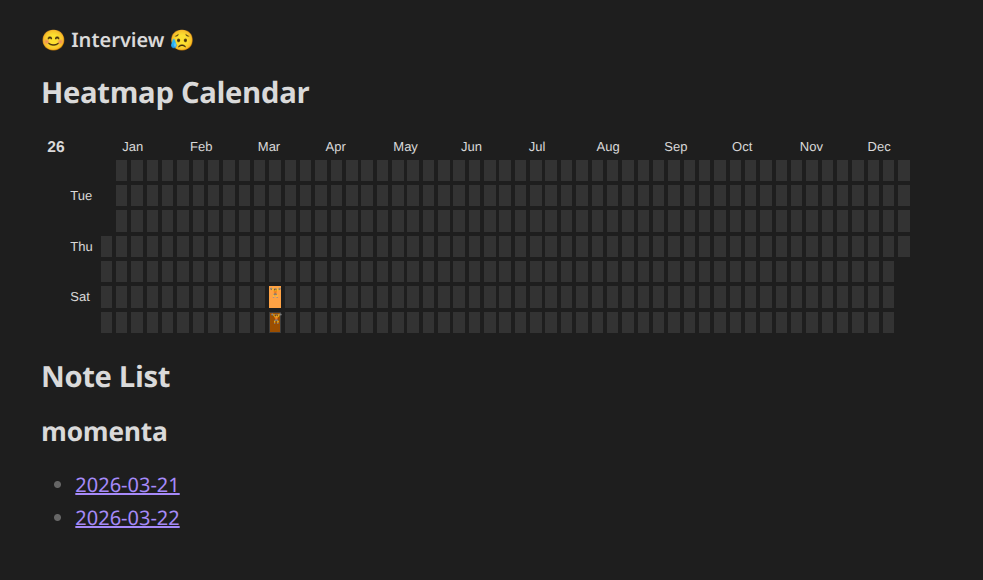

# Interview Records 

Welcome to this github repository! This is a collection of interview questions📝 compiled by **Duwl**, most of which are sourced from *Xiaohongshu*📔. It mainly focuses on algorithm interview questions, and also includes topics on Linux and Git.

---
## 📥 Import into Obsidian

1. **Get a local copy of this repository**
   - **Git:** `git clone https://github.com/duwl-SITP/CV_Deep-Learning_Interview.git` then open the cloned folder.
   - **No Git:** on GitHub use **Code → Download ZIP**, unzip, and use the extracted folder.

2. **Open it as an Obsidian vault**
   - Launch [Obsidian](https://obsidian.md/).
   - Choose **Open folder as vault** (not “Create new vault” unless you then copy these files in).
   - Select the **repository root** — the folder that contains `README.md` and the `record/` directory.  
     Using a parent folder (e.g. a vault that only *contains* this repo as a subfolder) can break the Dataview paths in `README.md` unless you adjust the scripts.

3. **Trust the vault (if prompted)**  
   Obsidian may ask you to trust the vault so that community plugins can run.

4. **Install and enable plugins** (see the **Required Plugins** section below)  
   - **Settings → Community plugins → Turn on community plugins** (if needed) → **Browse**, install **Dataview** and **Heatmap Calendar**, then enable both.

5. **Turn on Dataview JavaScript**  
   - **Settings → Dataview → Enable JavaScript Queries** (required for the `dataviewjs` block in `README.md`).

6. **View the dashboard**  
   - Open `README.md` in Obsidian and switch to **Reading view** (preview). The heatmap and note list render only inside Obsidian, not on GitHub.

---
## 📒 Notes Setup

This note system is built using **Obsidian**, featuring:

- 📊 Visualized heatmap
    
- 🗂️ Organization by source
    

---
## 🔌 Required Plugins

To enable full functionality, please install the following Obsidian plugins:

- **Dataview**
    
- **Heatmap Calendar**
    
---

# Record Display



The code is as follows:

```dataviewjs
dv.span("** 😊 Interview  😥**") /* optional ⏹️💤⚡⚠🧩↑↓⏳📔💾📁📝🔄📝🔀⌨️🕸️📅🔍✨*/
const calendarData = {
	colors: {    // (optional) defaults to green
		blue:        ["#8cb9ff", "#69a3ff", "#428bff", "#1872ff", "#0058e2"], // first entry is considered default if supplied
		green:       ["#c6e48b", "#7bc96f", "#49af5d", "#2e8840", "#196127"],
		red:         ["#ff9e82", "#ff7b55", "#ff4d1a", "#e73400", "#bd2a00"],
		orange:      ["#ffa244", "#fd7f00", "#dd6f00", "#bf6000", "#9b4e00"],
		pink:        ["#ff96cb", "#ff70b8", "#ff3a9d", "#ee0077", "#c30062"],
		orangeToRed: ["#ffdf04", "#ffbe04", "#ff9a03", "#ff6d02", "#ff2c01"]
	},
	showCurrentDayBorder: true, // (optional) defaults to true
	defaultEntryIntensity: 4,   // (optional) defaults to 4
	entries: [],                // (required) populated in the DataviewJS loop below
}
dv.header(2, "Heatmap Calendar")
const inRecord = (p) => {
	const path = String(p.file.path).replace(/\\/g, "/")
	return path === "record" || path.startsWith("record/") || path.includes("/record/")
}
const questionOf = (p) => p.questions ?? p.question
//DataviewJS loop
for (let page of dv.pages().where(p => inRecord(p) && questionOf(p))) {
	//dv.span("<br>" + page.file.name) // uncomment for troubleshooting
	calendarData.entries.push({
		date: String(page.file.name).replace(/\.md$/i, ""),
		intensity: questionOf(page),
		content: "🏋️",           // (optional) Add text to the date cell
		color: "orange",          // (optional) Reference from *calendarData.colors*. If no color is supplied; colors[0] is used
	})
}

renderHeatmapCalendar(this.container, calendarData)

// Note list
dv.header(2, "Note List")

const bySource = new Map()
for (let page of dv.pages().where(p => inRecord(p) && p.file.path !== dv.current().file.path)) {
	const raw = page.source
	const key = raw != null && String(raw).trim() !== "" ? String(raw).trim() : "hasn't source"
	if (!bySource.has(key)) bySource.set(key, [])
	bySource.get(key).push(page)
}

const sources = [...bySource.keys()].sort((a, b) => a.localeCompare(b, "zh-Hans-CN"))

if (sources.length === 0) {
	dv.paragraph("Not find note in `record`.")
} else {
	for (let src of sources) {
		const group = bySource.get(src).sort((a, b) => a.file.name.localeCompare(b.file.name))
		dv.header(3, src)
		dv.list(group.map(p => p.file.link))
	}
}

```


