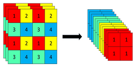

## 1. 为什么调整backbone低层卷积模块层数能够增加小目标检测性能？

小目标（例如在十几到几十像素甚至更小的目标）自身携带的视觉信息极少。在标准的卷积神经网络中，随着网络的加深，**频繁的下采样操作（如Pooling或Stride为2的卷积）会导致空间分辨率迅速下降。小目标很容易在这些深层特征图中缩减为不足一个像素，甚至完全“消失”**。

调整（通常是增加或优化）Backbone底层的卷积模块，能够**强化高分辨率下的特征表达：** 在网络进行大幅度下采样之前，特征图保持着较高的空间分辨率，包含了最丰富的边缘、角点、纹理等物理细节。通过在这一阶段增加卷积层数，网络可以在不丢失空间位置的前提下，提取更深层次、更具判别力的局部特征，为后续检测打下坚实的基础。

---

## 2. 为什么FPN对小目标检测性能好？

传统的单层特征检测方法面临一个两难境地：浅层网络分辨率高、定位准，但**语义信息弱**（无法准确分类）；深层网络语义强，但**分辨率低**（小目标位置已经丢失）。

FPN（Feature Pyramid Network）巧妙地打破了这一困境，其对小目标极其友好的原因在于：

1. **深层语义与浅层空间的完美融合（自顶向下与横向连接）：**
    
    FPN通过自顶向下的路径，将深层富含高级语义（High-level Semantics）的特征图上采样，然后通过横向连接（Lateral Connections，通常利用 $1 \times 1$ 卷积降维）与底层高分辨率的特征图进行逐元素相加。这赋予了底层特征图强大的上下文理解能力。换句话说，**它让看得清细节的浅层网络，也拥有了深层网络的大局观**。
    
2. **多尺度分治策略（Divide and Conquer）：**
    
    FPN构建了多个层级（如 $P_2$ 到 $P_5$）的特征金字塔，并强制让不同大小的目标在不同层级上进行预测。小目标被显式地分配到分辨率最高、融合了深层语义的底层特征图（如 $P_2$ 或 $P_3$）上去预测。这保证了小目标始终在拥有足够像素支撑的特征空间中被处理。
    
3. **全局上下文抑制背景干扰：**
    
    深层传导下来的语义特征不仅包含了“目标是什么”的信息，其本身也类似于一种隐式的空间注意力（Spatial Attention）机制。它能指导高分辨率的浅层特征图过滤掉杂乱的背景噪声，使模型更加聚焦于潜在的小目标区域。

---

## 3. 介绍YOLOv5网络

**自适应锚框计算 (Auto-learning Bounding Box Anchors)：** 在每次训练前，网络会根据你的自定义数据集自动重新聚类计算出最合适的Anchor尺寸，免去了手动运行K-Means的繁琐步骤。
### 主干网络 (Backbone - 特征提取)

Backbone的任务是在兼顾速度的同时，提取出表征能力极强的图像特征。

- **CSPNet (Cross Stage Partial Network)：** 这是YOLOv5 Backbone的核心灵魂。它将基础层特征图的通道一分为二，一部分经过深层的密集块（如Bottleneck），另一部分则直接通过残差连接到末端进行拼接。这种设计不仅大幅减少了计算量和内存占用，还保证了反向传播时梯度的丰富性，有效缓解了深层网络的梯度消失问题。
    
- **Focus 结构 (或 6x6 Conv)：** 在早期版本中，YOLOv5使用Focus层将空间信息切片并堆叠到通道维度，实现无损的下采样。
	
    
- **SPPF (Spatial Pyramid Pooling - Fast)：** 位于Backbone的末端。它通过串联多个小尺寸（如 5x5）的最大池化核来替代传统SPP中并联的大尺寸池化核。在获得相同感受野的前提下，SPPF的计算速度快得多。(*stride*为1，保持空间分辨率不变)。
    

### 颈部网络 (Neck - 特征融合)

YOLOv5的Neck采用了 **FPN + PANet (Path Aggregation Network)** 的双向融合架构。

- **FPN (自顶向下)：** 将深层的高级语义特征上采样，传递给浅层，让浅层网络获得“分辨目标类别”的能力。
    
- **PANet (自底向上)：** YOLOv5在FPN的基础上，增加了一条自底向上的路径。如果说FPN弥补了底层的语义不足，那么PANet则将底层富含边缘、形状等强定位特征向上回传，使得顶层的特征图也具备了更精准的位置信息。两者结合，实现了极其强大的多尺度特征对齐。
    

### 头部 (Head - 预测输出)

YOLOv5沿用了YOLOv3的检测头设计（耦合头），在三个不同的尺度（通常对应 8倍、16倍、32倍的下采样率，分别负责检测小、中、大目标）上输出预测张量。

- **损失函数设计：**  
	- **边界框回归损失 (Bounding Box Loss)：** 采用了 **CIoU Loss** (Complete IoU)。CIoU同时考虑了预测框与真实框的重叠面积、中心点距离以及长宽比的相对一致性，使得边界框的回归更加稳定、收敛更快。
$$ CIoU = 1 - \frac{\rho^{2} (b, b_{gt})}{c^{2}}$$
$$ \mathcal{L}_{CIoU} = 1 - CIoU $$
		 其中，$b$和$b_{gt}$为预测框与真实框的中心坐标，$\rho^{2}(\centerdot)$代表计算欧式距离，$c$为预测框与真实框的对角线距离。

	- 分类与置信度损失 (Class & Objectness Loss)：** 采用二元交叉熵损失 (BCE Loss)。

---

## 4. 什么是感受野？如何计算CNN中一层的感受野？

在卷积神经网络 (CNN) 中，**感受野 (Receptive Field, RF)** 指的是特征图 (Feature Map) 上的某一个像素点，映射回**原始输入图像**上所覆盖的区域大小。简而言之，它代表了网络中某个深层节点“能看到”的输入图像的范围。

感受野的计算是一个自底向上（从浅层到深层）的递推过程。计算时，我们需要知道每一层的**卷积核大小 (Kernel Size)** 和**步长 (Stride)**。

第 $l$ 层特征图的感受野大小 $RF_l$ 可以通过以下公式计算：

$$RF_l = RF_{l-1} + (k_l - 1) \times S_{l-1}$$

其中各个变量的含义如下：

- $RF_l$：当前第 $l$ 层的感受野大小。
    
- $RF_{l-1}$：上一层（第 $l-1$ 层）的感受野大小。对于输入图像本身（第 0 层），其感受野初始化为 $RF_0 = 1$。
    
- $k_l$：当前第 $l$ 层的卷积核大小（或池化核大小）。
    
- $S_{l-1}$：**累积步长**，指的是从第 1 层到第 $l-1$ 层所有步长的乘积。计算公式为：
    $$S_{l-1} = \prod_{i=1}^{l-1} s_i$$
    
    （其中 $s_i$ 是第 $i$ 层的步长）。
    
_注：Padding（填充）会影响特征图的输出分辨率，但**不影响**感受野大小的理论计算。_

---

## 5. torch和numpy分别怎样处理矩阵转秩？

### 二维数组/矩阵的简单转置

对于标准的 2D 矩阵，两者都提供了一个极其简便的 `.T` 属性。

| **操作**   | **NumPy**           | **PyTorch**                      |
| -------- | ------------------- | -------------------------------- |
| **属性调用** | `arr.T`             | `tensor.T`                       |
| **函数调用** | `np.transpose(arr)` | `torch.t(tensor)` 或 `tensor.t()` |


**注意：** 在 PyTorch 中，`.T` 和 `.t()` 仅适用于维度 $\le 2$ 的张量。如果张量维度更高，使用 `.T` 会报错或产生歧义。

### 多维张量的轴交换（维度重排）

当你处理图像数据（如 `[C, H, W]` 变 `[H, W, C]`）时，需要指定维度的顺序。NumPy 使用 `transpose` 并传入一个轴的排列元组。

``` python
import numpy as np
arr = np.random.randn(3, 224, 224) 
# 将 [C, H, W] 转换为 [H, W, C]
transposed = arr.transpose(1, 2, 0) 
```

PyTorch 区分了“交换两个维度”(**transpose**)和“重新排列所有维度”(**permute**)：

- **`permute(*dims)`**: 最常用的方法，一次性重新排列所有维度的顺序（类似于 NumPy 的 `transpose`）。
    
``` python
# 将 [Batch, C, H, W] 转换为 [Batch, H, W, C]
shifted = tensor.permute(0, 2, 3, 1)
```
    
- **`transpose(dim0, dim1)`**: **仅交换**指定的两个维度。
    
``` python
# 只交换高度和宽度
swapped = tensor.transpose(2, 3)
```

### 内存连续性（核心区别）

- **NumPy**: `transpose` 通常返回一个**视图（View）**，其内存布局是不连续的。但在大多数 NumPy 操作中，这被透明处理了。
    
- **PyTorch**: 转置操作同样返回视图，不改变内存中的实际存储。但在调用某些方法（如 `.view()`）之前，必须先调用 `.contiguous()`。
    
``` python
# 常见报错解决
y = tensor.transpose(0, 1).contiguous().view(-1)
```

---

## 6. python中的@是什么？

在 Python 中，`@` 符号主要有两种用途：**装饰器（Decorator）** 和 **矩阵乘法运算符**。

### 1. 装饰器 (Decorator)

这是 `@` 最常见的用法，属于**语法糖**，用于在不修改原函数代码的情况下增强其功能。

- **核心原理**：`@decorator` 等价于 `func = decorator(func)`。它将下方的函数作为参数传给装饰器函数，并返回一个新的函数对象。
    
- **常用场景**：日志记录、权限校验、缓存 (`@lru_cache`)、属性定义 (`@property`)。
    

``` python
def debug(func):
    def wrapper(*args, **kwargs):
        print(f"Calling {func.__name__}")
        return func(*args, **kwargs)
    return wrapper

@debug
def my_func():
    pass 
```

---

### 2. 矩阵乘法运算符 (Matrix Multiplication)

自 Python 3.5 (PEP 465) 引入，专门用于数学上的矩阵乘法。

- **核心原理**：调用对象的 `__matmul__` 魔法方法。
    
- **对比 `*` 运算符**：
    
    - `*`：执行 **Element-wise**（逐元素）乘法。
        
    - `@`：执行 **Matrix Multiplication**（点积/矩阵乘法）。
        
- **典型库支持**：NumPy, PyTorch, TensorFlow。
    

``` python
import numpy as np

A = np.array([[1, 2], [3, 4]])
B = np.array([[5, 6], [7, 8]])

# 矩阵乘法结果
result = A @ B  
# 等价于 np.matmul(A, B)
```

---

### 3. 面试考点与避坑指南

- **考点 1：装饰器的闭包特性**。面试官常问装饰器内部如何保存状态（通过闭包）。
    
- **考点 2：多个装饰器的执行顺序**。
    
    - 加载顺序：由下而上（靠近函数的先封装）。
        
    - 执行顺序：由上而下（外层的先触发入场）。
        
- **考点 3：`functools.wraps` 的作用**。使用装饰器后，原函数的 `__name__` 和 `docstring` 会丢失，必须使用 `@wraps(func)` 来修复元数据。
    
