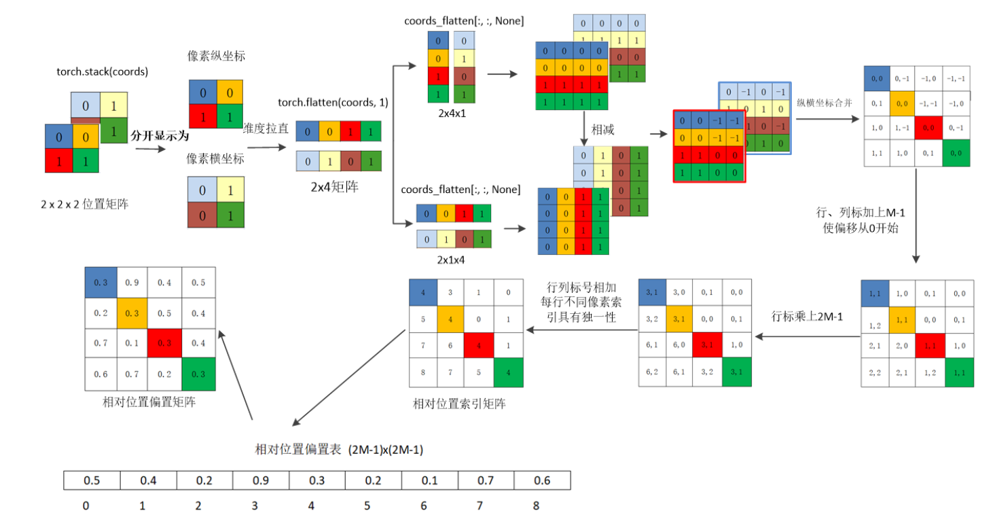

## 1. Flash Attention原理

### A. Softmax部分

假设我们有一行完整的 Attention Score（即 $QK^T$ 的一行），里面只有 4 个数字：$[x_1, x_2, x_3, x_4]$。

我们要把它分成两个 Block 来算：

- **Block 1**: $[x_1, x_2]$
    
- **Block 2**: $[x_3, x_4]$

#### 标准 Softmax 是怎么算的？

先遍历一遍找全局最大值 $m_{global} = \max(x_1, x_2, x_3, x_4)$。然后算全局分母：

$$L_{global} = e^{x_1 - m_{global}} + e^{x_2 - m_{global}} + e^{x_3 - m_{global}} + e^{x_4 - m_{global}}$$

#### FlashAttention 的在线 Softmax 是怎么算的？

**在处理 Block 1 时：**

找到局部最大值 $m_1 = \max(x_1, x_2)$。

算出局部指数和 $l_1 = e^{x_1 - m_1} + e^{x_2 - m_1}$。

**在处理 Block 2 时：**

找到局部最大值 $m_2 = \max(x_3, x_4)$。

算出局部指数和 $l_2 = e^{x_3 - m_2} + e^{x_4 - m_2}$。

**合并阶段：**

全局最大值更新为 $m_{new} = \max(m_1, m_2)$。

现在，我们套用前面提到的“打补丁（Rescale）”公式来更新全局分母 $l_{new}$：

$$l_{new} = l_1 \cdot e^{m_1 - m_{new}} + l_2 \cdot e^{m_2 - m_{new}}$$

我们把 $l_1$ 和 $l_2$ 的原公式代入展开：

$$l_{new} = (e^{x_1 - m_1} + e^{x_2 - m_1}) \cdot e^{m_1 - m_{new}} + (e^{x_3 - m_2} + e^{x_4 - m_2}) \cdot e^{m_2 - m_{new}}$$

利用指数乘法法则 $e^A \cdot e^B = e^{A+B}$，括号里的 $m_1$ 和 $m_2$ 被**完美抵消**了。

$$l_{new} = e^{x_1 - m_{new}} + e^{x_2 - m_{new}} + e^{x_3 - m_{new}} + e^{x_4 - m_{new}}$$

---

## 2. 除了正余弦位置编码，还有什么位置编码方式？

### 2.1 可学习的绝对位置编码 (Learnable Absolute Position Encoding)

这是在 BERT 和 GPT 早期最常用的方案，甚至在最初的视觉大模型 ViT 中也采用了这种方式。

- **核心原理**：不使用固定的数学公式（如正余弦），而是像给词表做 Embedding 一样，给每一个位置索引（$0, 1, 2, \dots, N$）初始化一个可学习的向量。在模型训练过程中，通过反向传播让模型自己学习每个位置的特征。
    
- **优点**：实现极其简单，模型可以根据特定任务的数据分布自由调整位置表示。
    
- **缺点**：**缺乏外推性（Extrapolation）**。如果训练时最大序列长度是 512，推理时如果输入长度达到 513，模型就找不到第 513 个位置的编码了，直接崩溃或性能骤降。

### 2.2 相对位置编码

在 Swin Transformer 的窗口自注意力（W-MSA）中，相对位置偏置 $B$ 是在 Softmax 之前，直接加到注意力打分矩阵（Attention Score）上的：

$$\text{Attention}(Q, K, V) = \text{Softmax}\left(\frac{QK^T}{\sqrt{d}} + B\right)V$$

- **$Q, K \in \mathbb{R}^{M^2 \times d}$**：$M^2$ 是一个窗口内的 Token 数量（默认窗口大小 $M=7$，即 49 个 Token）。
    
- **$QK^T$ 的形状**：$M^2 \times M^2$（即 $49 \times 49$）。它代表窗口内这 49 个 Token 两两之间的特征相似度。
    
- **$B$ 的形状**：同样是 $M^2 \times M^2$（$49 \times 49$）。它代表这 49 个 Token 两两之间的**二维空间相对距离打分**。

具体计算流程见下图，简单来说就是计算每个坐标位置相对于其他位置的相对坐标。如果直接为 $49 \times 49$ 的矩阵维护一个位置编码，参数量是 $2401$。但实际上，很多 Token 对之间的**相对距离是完全相同的**（比如坐标 $(0,0)$ 到 $(1,1)$ 的距离，和 $(1,1)$ 到 $(2,2)$ 的距离是一样的）。

因此，Swin Transformer 建立了一个极小的**可学习参数表 $\hat{B}$**：

- **参数表的大小**：$(2M - 1) \times (2M - 1)$，对于 $M=7$，表中只有 **169** 个参数。
    
- **工作原理**：当我们需要计算 $B$ 矩阵中某个位置的值时，我们算出对应两个 Token 的相对坐标，然后把这个坐标当作**索引（Index）**，去参数表 $\hat{B}$ 里把对应的值“查”出来，填进 $B$ 矩阵里。

---

## 3. 交叉熵损失函数与最大似然的关系

在二分类问题中，对于第 $i$ 个样本：

- **真实标签**：$y_i \in \{0, 1\}$。
    
- **模型输出（Logits）**：$z_i$。
    
- **预测概率**：经过 Sigmoid 激活后，模型预测该样本属于正类（$y_i=1$）的概率为 $\hat{y}_i = P(y_i=1 | z_i) = \frac{1}{1+e^{-z_i}}$。

同理，样本属于负类（$y_i=0$）的概率为 $1 - \hat{y}_i$。

对于任意一个观测到的真实样本 $(z_i, y_i)$，模型预测出这个真实结果的概率可以写为：

$$P(y_i | z_i) = (\hat{y}_i)^{y_i} \cdot (1 - \hat{y}_i)^{1 - y_i}$$

假设我们有 $N$ 个独立同分布（i.i.d.）的样本，那么这 $N$ 个真实结果**同时发生**的联合概率，就是单样本概率的连乘积。这就是似然函数 $L$：

$$L = \prod_{i=1}^{N} P(y_i | z_i) = \prod_{i=1}^{N} \left[ (\hat{y}_i)^{y_i} \cdot (1 - \hat{y}_i)^{1 - y_i} \right]$$

取自然对数：

$$\ln(L) = \sum_{i=1}^{N} \ln \left[ (\hat{y}_i)^{y_i} \cdot (1 - \hat{y}_i)^{1 - y_i} \right]$$
$$\ln(L) = \sum_{i=1}^{N} \left[ y_i \ln(\hat{y}_i) + (1 - y_i) \ln(1 - \hat{y}_i) \right]$$

最大似然估计（MLE）的目标是**最大化**对数似然函数 $\ln(L)$。而在深度学习中，优化器的目标是**最小化**损失函数 $\mathcal{L}$。

因此，**最大化一个函数，等价于最小化它的相反数（即取负号）**：

$$\arg\max \ln(L) \iff \arg\min [-\ln(L)]$$

我们定义负对数似然（Negative Log-Likelihood, NLL）为损失函数 $\mathcal{L}$：

$$\mathcal{L} = -\ln(L) = -\sum_{i=1}^{N} \left[ y_i \ln(\hat{y}_i) + (1 - y_i) \ln(1 - \hat{y}_i) \right]$$

**这是标准的二元交叉熵损失函数（Binary Cross-Entropy Loss）的公式。**
$$log(L)=\sum_{i}^{N} log(\frac{1}{1+e^{-x_{i}}})$$
